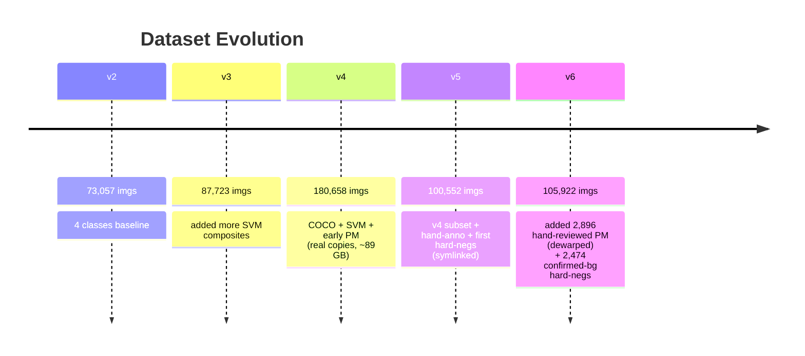
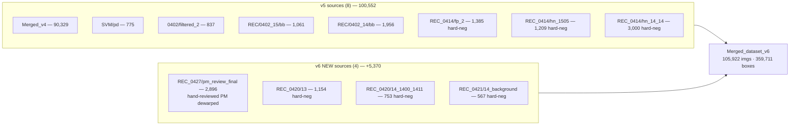
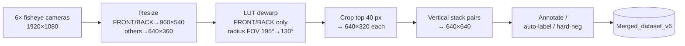
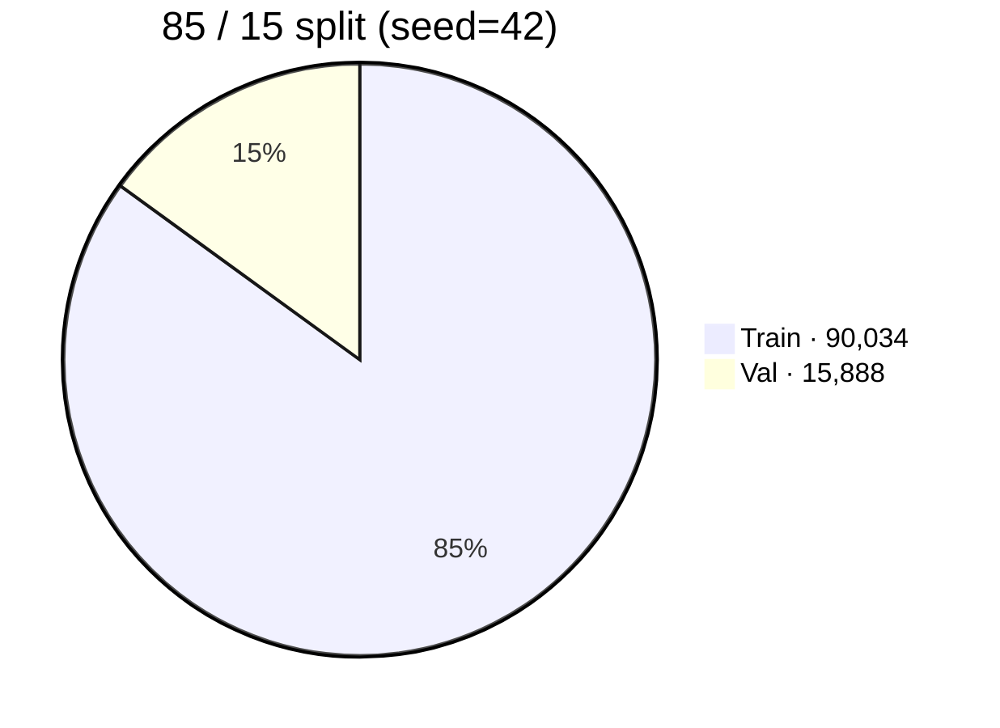
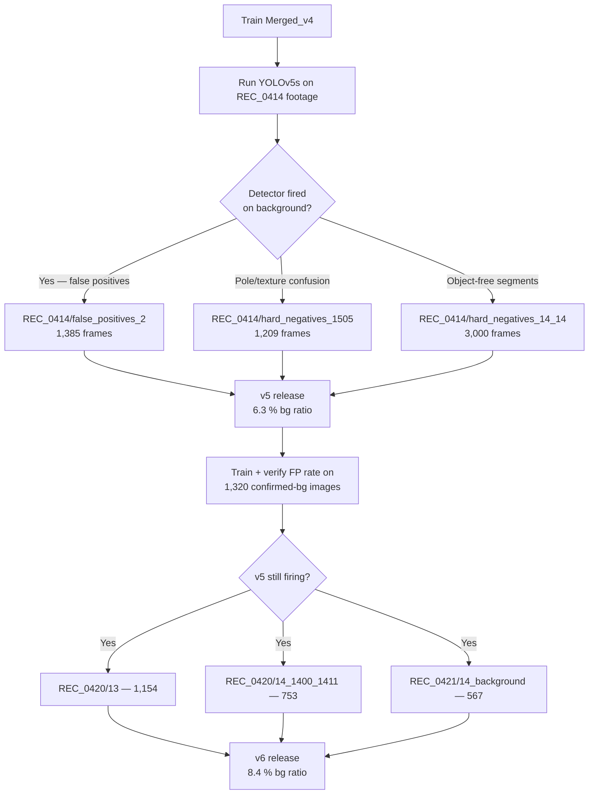
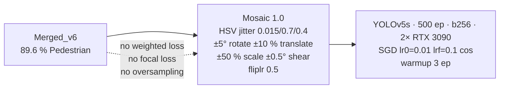

# 简介
* 此仓库为c++实现, 大体改自[rknpu2](https://github.com/rockchip-linux/rknpu2), python快速部署见于[rknn-multi-threaded](https://github.com/leafqycc/rknn-multi-threaded)
* 使用[线程池](https://github.com/senlinzhan/dpool)异步操作rknn模型, 提高rk3588/rk3588s的NPU使用率, 进而提高推理帧数
* [yolov5s](https://github.com/rockchip-linux/rknpu2/tree/master/examples/rknn_yolov5_demo/model/RK3588)使用relu激活函数进行优化,提高推理帧率

# 更新说明
* 修复了cmake找不到pthread的问题
* 新增nosigmoid分支,使用[rknn_model_zoo](https://github.com/airockchip/rknn_model_zoo/tree/main/models)下的模型以达到极限性能提升
* 将RK3588 NPU SDK 更新至官方主线1.5.0, [yolov5s-silu](https://github.com/rockchip-linux/rknn-toolkit2/tree/v1.4.0/examples/onnx/yolov5)将沿用1.4.0的旧版本模型, [yolov5s-relu](https://github.com/rockchip-linux/rknpu2/tree/master/examples/rknn_yolov5_demo/model/RK3588)更新至1.5.0版本, 弃用nosigmoid分支。
* 新增v1.5.0分支(向下兼容1.4.0), main分支更新至v1.5.2, 修改了项目结构, 将rknn模型线程池封装成类(include/rknnPool.hpp)

# 使用说明
### 演示
  * 系统需安装有**OpenCV**
  * 下载Releases中的测试视频于项目根目录,运行build-linux_RK3588.sh
  * 可切换至root用户运行performance.sh定频提高性能和稳定性
  * 编译完成后进入install运行命令./rknn_yolov5_demo **模型所在路径** **视频所在路径/摄像头序号**

### 部署应用
  * 参考include/rkYolov5s.hpp中的rkYolov5s类构建rknn模型类

# 多线程模型帧率测试
* 使用performance.sh进行CPU/NPU定频尽量减少误差
* 测试模型来源: 
* [yolov5s-relu](https://github.com/rockchip-linux/rknpu2/tree/master/examples/rknn_yolov5_demo/model/RK3588)
* 测试视频可见于 [bilibili](https://www.bilibili.com/video/BV1zo4y1x7aE/?spm_id_from=333.999.0.0)

|  模型\线程数   | 1    |  2   | 3  |  4  | 5  | 6  | 9  | 12  |
|  ----  | ----  |  ----  | ----  |  ----  | ----  | ----  | ----  | ----  |
| Yolov5s - relu  | 41.6044 | 71.6037 | 98.6057 | 98.0068 | 104.6001 | 114.7454 | 129.5693 | 140.8788 |

# 补充
* 异常处理尚未完善, 目前仅支持rk3588/rk3588s下的运行

# Acknowledgements
* https://github.com/rockchip-linux/rknpu2
* https://github.com/senlinzhan/dpool
* https://github.com/ultralytics/yolov5
* https://github.com/airockchip/rknn_model_zoo


# SVM YOLOv5 Dataset — Creation History v1 → v6

> **Purpose:** Surround-View Monitoring (SVM) object detection for embedded deployment on the Rockchip RK3588 NPU (OrangePi 5 Plus). Four classes: **Pedestrian, Bicycle, Motorcycle, PM** (Personal Mobility).
> **Updated:** 2026-05-07 · **Current:** Merged_dataset_v6 (105,922 imgs, 359,711 boxes)

---

## 1. Version Timeline



| Version | Train | Val | Total | Notes |
|---|---|---|---|---|
| v2 | 62,098 | 10,959 | **73,057** | first 4-class baseline |
| v3 | 74,564 | 13,159 | **87,723** | grew SVM composites |
| v4 | 154,340 | 26,318 | **180,658** | + COCO subset; physical copies |
| v5 | 85,920 | 14,632 | **100,552** | symlink-based; +3 hard-neg sources |
| **v6** | **90,034** | **15,888** | **105,922** | + REC_0427 hand-reviewed PM, + REC_0420/REC_0421 hard-negs |

---

## 2. v5 → v6 Source-Level Diff



### v6 source manifest

| # | Source | Imgs | Type | First in |
|---|---|---|---|---|
| 1  | Merged_dataset_v4                              | 90,329 | SVM composites + COCO + early PM         | v5 |
| 2  | SVM_Dataset/pd (class remap 2↔3)               |    775 | Hand-annotated (Ped + Bicycle)            | v5 |
| 3  | 0402/filtered_2                                |    837 | Hand-annotated SVM                        | v5 |
| 4  | REC/20260402_15/bb (val only)                  |  1,061 | Hand-annotated Bicycle + Moto             | v5 |
| 5  | REC/20260402_14/bb_0402_14                     |  1,956 | Hand-annotated 4-class                    | v5 |
| 6  | REC_0414/false_positives_2                     |  1,385 | Hard negative                             | v5 |
| 7  | REC_0414/hard_negatives_1505                   |  1,209 | Hard negative (false-bicycle pole scene)  | v5 |
| 8  | REC_0414/hard_negatives_14_14                  |  3,000 | Hard negative (object-free segment)       | v5 |
| 9  | **REC_0427/pm_review_final** *(NEW)*           |  **2,896** | **Hand-reviewed PM, dewarped**       | **v6** |
| 10 | **REC_0420/20260420_13** *(NEW)*               |  **1,154** | Hard negative (background sweep)     | **v6** |
| 11 | **REC_0420/20260420_14_1400_1411** *(NEW)*     |    **753** | Hard negative (time slice)           | **v6** |
| 12 | **REC_0421/20260421_14_background** *(NEW)*    |    **567** | Hard negative (3-model FP curated)   | **v6** |
|    | **Total**                                       | **105,922** |                                          |    |

---

## 3. Image Acquisition Pipeline (every source above goes through this)



The three stack pairs are `(FRONT+LEFT)`, `(BACK+RIGHT)`, `(SIDE-LEFT+SIDE-RIGHT)`. PM annotations from source #9 were curated on the **dewarped** stack to match the rest of the corpus.

---

## 4. v6 Statistics Snapshot

### 4.1 Headline numbers

| Metric | Value |
|---|---|
| Total images | **105,922** |
| Total bounding boxes | **359,711** |
| Train / Val | 90,034 / 15,888 |
| Background-only images | 8,859 (**8.4 %**) |
| Image resolution | 640 × 640 (canonical) |
| Image format | `.jpg` 98.0 %, `.png` 2.0 % |
| Annotation format | YOLO `(class_id cx cy w h)` |
| Mean objects/image | ~3.4 |
| Max objects/image | several dozen |

### 4.2 Class distribution

| ID | Class       | Train | Val | **Total** | Share |
|----|-------------|-------|-----|-----------|-------|
| 0  | Pedestrian  | 273,710 | 48,497 | **322,207** | **89.6 %** |
| 1  | Bicycle     |  11,338 |  1,872 | **13,210**  |  3.7 % |
| 2  | Motorcycle  |  10,645 |  1,878 | **12,523**  |  3.5 % |
| 3  | PM          |  10,086 |  1,685 | **11,771**  |  3.3 % |


### 4.3 Train / Val split




### 4.4 Image dimensions

The canonical SVM stack is **640 × 640**. However v4-inherited sources (COCO subset + early SVM composites) include other shapes, sampled distribution from a 1-in-200 read of v6:

- **640 × 640** — dominant canonical stack
- 640 × 480 / 480 × 640 — COCO landscape / portrait
- 500 × … / … × 500 — COCO source-aspect imagery
- 1920 × 1080 — a handful of raw frames in v4 inheritance

YOLOv5 letterbox-resizes all inputs to 640 px at training time, so this heterogeneity is benign.

### 4.5 Image format


JPEG dominates (103,748 imgs, 98.0 %); PNG present in 2,174 imgs (2.0 %, mostly REC_0414 hard-negatives).

### 4.6 Annotation locations (bounding-box centers)

The dataset is a **vertically-stacked composite**, so annotations cluster along two horizontal bands — one per camera-pair half. Pedestrians populate both halves; PM tends to sit near each half's mid-line; bicycles/motorcycles slightly off-center.


(Pre-generated per-class heatmaps available: `heatmap_pedestrian.png`, `heatmap_bicycle.png`, `heatmap_motorcycle.png`, `heatmap_pm.png`.)

### 4.7 Bounding-box dimensions


Most boxes are **small to medium** (target objects at typical SVM distances). Long-tail of large boxes from close-range encounters and occasional full-frame objects.

### 4.8 Objects per image


Bimodal: large peak at 0 (background-only ≈ 8 % of images) and a broad shoulder around 1–6 boxes/image. A small tail extends to dense urban scenes.

---

## 5. Hard-negative Mining Story



Result: v5 had a 4.85 % image-level FP rate on the 1,320 confirmed-background test set. v6 reached **0.15 %** — a 32× reduction. PM detection: mAP@50 0.873 → 0.944 (+8.1 pp), Recall 0.770 → 0.878 (+10.8 pp).

---

## 6. Class-Imbalance & Augmentation Strategy



Class imbalance is **not** addressed in the loss (no weights, no focal). It is handled at the **dataset level** via:
- Hand-annotated PM-rich subsets (Sources 5, 9)
- Explicit Bicycle/Motorcycle augmentation through Sources 2-5
- Hard-negative dilution to suppress dominant-class false positives

---

## 7. File Layout

```
Merged_dataset_v6/
├── data.yaml                        # YOLOv5/8 training config
├── dataset_info.txt                 # auto-generated source manifest
├── dataset_description.md           # short summary
├── dataset_history.md               # this file
├── stats_v6.json                    # raw stats dump
├── class_distribution.png           # short bar chart
├── heatmap_*.png                    # per-class 20×20 center heatmaps
├── fig_class_split.png              # train/val class bars
├── fig_split_pie.png
├── fig_bbox_size.png
├── fig_centers.png
├── fig_obj_per_img.png
├── fig_format.png
├── train/
│   ├── images/   (90,034 symlinks → original sources)
│   └── labels/   (90,034 .txt; 7,521 empty)
└── val/
    ├── images/   (15,888 symlinks)
    └── labels/   (15,888 .txt; 1,338 empty)
```

---

## 8. Reproducibility

The dataset is rebuildable from `scripts/create_merged_v6_split.py`:

```bash
python /home/hbrain/Desktop/yolov5/scripts/create_merged_v6_split.py
```

Idempotent given fixed seed (`SEED=42`), deterministic source listing, and 85 / 15 split ratio. All twelve constituent source directories must exist; v6 stores **symlinks**, not copies (≈ 800 MB total dataset footprint vs. ~89 GB for v4).

---

## 9. Outstanding Items for v7+

- **Pending hard-negative mining** from REC_0504 sessions (S15/S16/S17) — currently being processed; 0 frames kept yet from S14 review.
- **REC_0427 PM session** review of the additional un-extracted videos.
- **PM annotation parity** — class still under-represented relative to natural scene frequency; targeted PM-rich recordings encouraged.
- **Quantization regression** — INT8 RKNN benchmark vs FP32 still needs to be measured.
