# 简介
* 此仓库为c++实现, 大体改自[rknpu2](https://github.com/rockchip-linux/rknpu2), python快速部署见于[rknn-multi-threaded](https://github.com/leafqycc/rknn-multi-threaded)
* 使用[线程池](https://github.com/senlinzhan/dpool)异步操作rknn模型, 提高rk3588/rk3588s的NPU使用率, 进而提高推理帧数
* [yolov5s](https://github.com/rockchip-linux/rknpu2/tree/master/examples/rknn_yolov5_demo/model/RK3588)使用relu激活函数进行优化,提高推理帧率

# 更新说明
* 修复了cmake找不到pthread的问题
* 新增nosigmoid分支,使用[rknn_model_zoo](https://github.com/airockchip/rknn_model_zoo/tree/main/models)下的模型以达到极限性能提升
* 将RK3588 NPU SDK 更新至官方主线1.5.0, [yolov5s-silu](https://github.com/rockchip-linux/rknn-toolkit2/tree/v1.4.0/examples/onnx/yolov5)将沿用1.4.0的旧版本模型, [yolov5s-relu](https://github.com/rockchip-linux/rknpu2/tree/master/examples/rknn_yolov5_demo/model/RK3588)更新至1.5.0版本, 弃用nosigmoid分支。
* 新增v1.5.0分支(向下兼容1.4.0), main分支更新至v1.5.2, 修改了项目结构, 将rknn模型线程池封装成类(include/rknnPool.hpp)

# 使用说明
### 演示
  * 系统需安装有**OpenCV**
  * 下载Releases中的测试视频于项目根目录,运行build-linux_RK3588.sh
  * 可切换至root用户运行performance.sh定频提高性能和稳定性
  * 编译完成后进入install运行命令./rknn_yolov5_demo **模型所在路径** **视频所在路径/摄像头序号**

### 部署应用
  * 参考include/rkYolov5s.hpp中的rkYolov5s类构建rknn模型类

# 多线程模型帧率测试
* 使用performance.sh进行CPU/NPU定频尽量减少误差
* 测试模型来源: 
* [yolov5s-relu](https://github.com/rockchip-linux/rknpu2/tree/master/examples/rknn_yolov5_demo/model/RK3588)
* 测试视频可见于 [bilibili](https://www.bilibili.com/video/BV1zo4y1x7aE/?spm_id_from=333.999.0.0)

|  模型\线程数   | 1    |  2   | 3  |  4  | 5  | 6  | 9  | 12  |
|  ----  | ----  |  ----  | ----  |  ----  | ----  | ----  | ----  | ----  |
| Yolov5s - relu  | 41.6044 | 71.6037 | 98.6057 | 98.0068 | 104.6001 | 114.7454 | 129.5693 | 140.8788 |

# 补充
* 异常处理尚未完善, 目前仅支持rk3588/rk3588s下的运行

# Acknowledgements
* https://github.com/rockchip-linux/rknpu2
* https://github.com/senlinzhan/dpool
* https://github.com/ultralytics/yolov5
* https://github.com/airockchip/rknn_model_zoo


# SVM Detection Dataset — Build Story

> **Goal:** train a vehicle Surround-View Monitoring (SVM) detector that recognises four road-user classes: **Pedestrian · Bicycle · Motorcycle · Personal Mobility (PM)** — to run on an on-board NPU (OrangePi 5 Plus / RK3588).
> **Latest snapshot:** 105,922 images · 359,711 labelled objects.

---

## 1. How the dataset grew

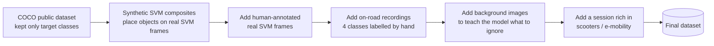

We did not collect everything at once. The dataset was built in stages — each stage targeted a specific weakness we observed in the model after testing.

---

## 2. The journey, version by version

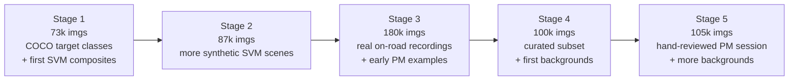

| Stage | Total images | Why this stage was added |
|---|---|---|
| 1 | 73,057  | First working baseline — recognise the four classes at all |
| 2 | 87,723  | Improve coverage of poses and viewpoints |
| 3 | 180,658 | Bring in real on-road footage + first scooter / PM examples |
| 4 | 100,552 | Curated subset + first batch of "do-not-trigger" backgrounds |
| 5 (current) | **105,922** | Targeted scooter session + more curated backgrounds |

> Note on the image-count drop between Stage 3 and Stage 4: we removed redundant synthetic frames and switched to a leaner, fully-symlinked dataset that takes ~800 MB on disk instead of 89 GB, while keeping the high-value examples.

---

## 3. What's inside the current dataset

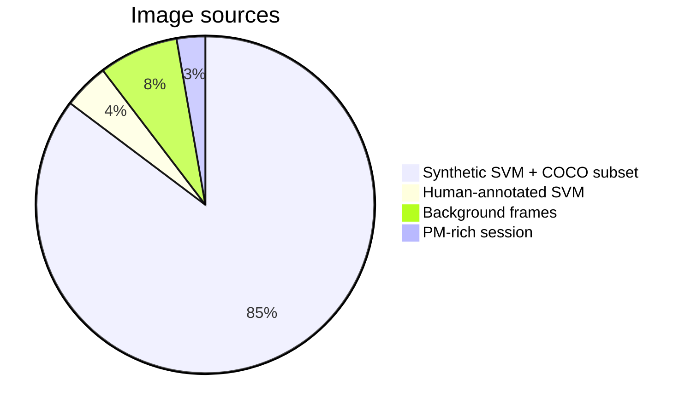

| Category | Images | Role |
|---|---|---|
| Synthetic SVM composites + COCO subset | 90,329 | Bulk class-recognition signal |
| Human-annotated SVM / on-road frames    |  4,629 | Real-world appearance and geometry |
| Background frames (no objects)          |  8,068 | Suppress false alarms |
| PM-rich hand-reviewed session           |  2,896 | Strengthen the rarest class |

---

## 4. Class distribution

| Class | Total bounding boxes | Share |
|---|---|---|
| Pedestrian | **322,207** | 89.6 % |
| Bicycle    | **13,210**  | 3.7 % |
| Motorcycle | **12,523**  | 3.5 % |
| PM         | **11,771**  | 3.3 % |


Pedestrians dominate naturally — they are the most frequent road user. The other three classes are rarer but consistently present, and we have spent significant effort to keep them well-represented.

---

## 5. Where objects appear in the image

The image format is a **640 × 640 stacked composite** of two camera views (top + bottom). The heatmap below shows where labelled objects sit. The two horizontal bands correspond to the two stacked camera halves.


This visualisation confirms the camera geometry is consistent across the whole dataset.

---

## 6. Image sizes and formats

- **Canonical input size:** 640 × 640 (the SVM stack)
- Some legacy COCO-derived images come in other sizes; the training pipeline standardises everything to 640 px automatically.
- **Format:** JPEG 98 %, PNG 2 %.


---

## 7. Object size and density

- Most labelled objects are **small to medium** in pixel size — consistent with road-users seen from the vehicle's surround cameras.
- A typical image contains **0–6 objects**. Some frames intentionally contain **zero objects** (the background-only frames).


---

## 8. Train / Validation split

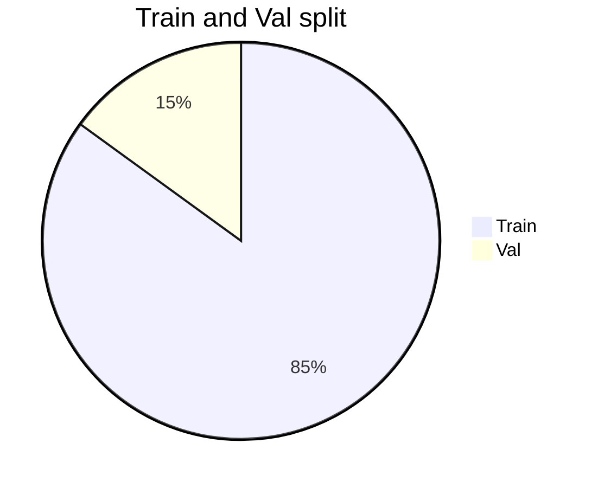

The split is a fixed random shuffle (reproducible). Background-only images are spread across both splits in the same proportion.

---

## 9. Why each stage was added — short summary

1. **Stage 1–2 — COCO + Synthetic SVM:** start with public, well-labelled imagery and combine it with our SVM camera scenes so the model first learns what each class looks like.
2. **Stage 3 — Real on-road recordings:** the synthetic composites cannot capture real-world lighting, motion blur and camera distortion. Adding hand-labelled drives gives the model authentic context.
3. **Stage 4 — Background images:** when we tested the model on real driving footage we saw it "imagining" objects (false alarms) on poles, trees and shadows. We collected those exact scenes and labelled them as empty so the model learns to ignore them.
4. **Stage 5 — PM-rich session + more backgrounds:** PM (e-scooters / e-mobility) is the rarest class and was being missed. We recorded a dedicated outing where PM riders were present, then a human reviewed every frame to ensure correct labels.

---

## 10. Where this is leading

Each stage of the dataset has produced a measurable improvement in the model. The current model:
- recognises **scooters / PM far more reliably** than before;
- **almost never produces false alarms** on plain-background driving scenes;
- runs on the on-board NPU within the project's real-time budget.

We continue to mine new failure modes from new recordings; those become the next stage of the dataset.


# Merged_dataset_v9 — Dataset Creation & Comparison vs v8

**Build date**: 2026-06-02
**Total images**: 124,804 (vs v8: 116,048, **+9.1 %**)
**Total boxes**: 378,358 (vs v8: 364,138, **+4.0 %**)
**Source count**: 20 (vs v8: 18, **+2**)
**Train / val split**: 106,084 / 18,720 (85 / 15, seed=42)

---

## 1. Executive Summary

v9 extends v8 by **closing two major coverage gaps**:
- **First-ever hand-reviewed BACK+RIGHT night/rain data** (REC_0520_20, 1,500 images)
- **First-ever hand-reviewed FRONT+LEFT night data** (REC_0528_2100, 2,240 images)

It also **expands existing night/rain sources**:
- REC_0514_20 SIDEL+SIDER: 2,600 → 5,240 (+102 %)
- REC_0520_20 SIDEL+SIDER: 2,950 → 3,240 (+9.8 %)

Result: **night/rain training material grew 2.6× (5,550 → 14,306 images)**, with the biggest gains in rare class examples (Motorcycle +1046 %, PM +246 % in night/rain).

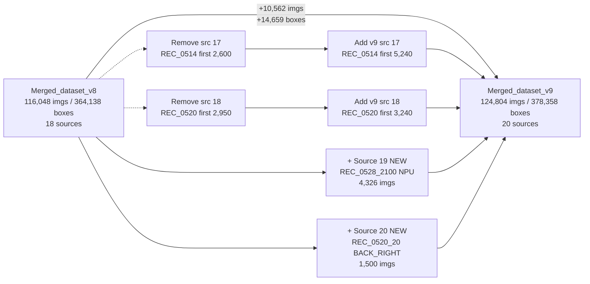

---

## 2. Source Inventory: v8 vs v9

### Unchanged sources (1–16) — carry over from v8

| # | Source | Type | Imgs |
|---|---|---|---|
| 1 | Merged_dataset_v4 (SVM composites + COCO + PM) | base | (large) |
| 2 | SVM_Dataset/pd (class remap 2↔3) | SVM-stack early | 775 |
| 3 | 0402/filtered_2 | early day | 837 |
| 4 | REC/20260402_15/bb (val only) | early day | 1,061 |
| 5 | REC/20260402_14/bb_0402_14 | early day | 1,956 |
| 6 | REC_0414/.../false_positives_2 | hard neg | 1,385 |
| 7 | REC_0414/hard_negatives_1505 | hard neg | 1,209 |
| 8 | REC_0414/hard_negatives_14_14 | hard neg | 3,000 |
| 9 | REC_0427/pm_review_final | PM hand-reviewed | 2,896 |
| 10 | REC_0420/20260420_13 | hard neg | 1,154 |
| 11 | REC_0420/20260420_14_1400_1411 | hard neg | 753 |
| 12 | REC_0421/20260421_14_background | hard neg | 567 |
| 13 | REC_0504_1523_dataset | day hand-reviewed | 3,350 |
| 14 | REC_0504_14_background | hard neg (v6 FP-confirmed) | 35 |
| 15 | REC_0512_15_FRONT_LEFT_dataset | day hand-reviewed | 445 |
| 16 | REC_0512_15_SIDEL_SIDER_dataset | day hand-reviewed | 746 |

### Changed and new sources (17–20)

| # | v8 | v9 | Δ imgs |
|---|---|---|---|
| 17 | REC_0514_20 SIDEL+SIDER (2,600) | **REC_0514_20 SIDEL+SIDER (5,240)** | +2,640 |
| 18 | REC_0520_20 SIDEL+SIDER (2,950) | **REC_0520_20 SIDEL+SIDER (3,240)** | +290 |
| 19 | — | **REC_0528_2100 hand-reviewed (4,326)** | +4,326 |
| 20 | — | **REC_0520_20 BACK+RIGHT (1,500)** | +1,500 |

---

## 3. v9 Data-Creation Pipeline

The new v9 sources were produced through a multi-stage pipeline combining model-assisted pseudo-labeling, ByteTrack gap-filling, and human hand-review.

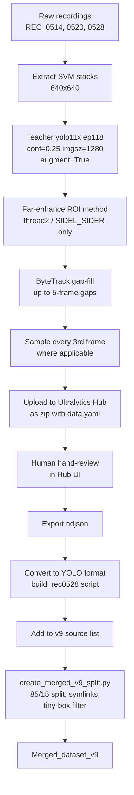

### 3.1 Teacher YOLOv11x training

A **YOLOv11x** model (57M params, 8× larger than the v8 YOLOv5s) was trained on **Merged_dataset_v8** to serve as a higher-quality pseudo-labeler for v9 sources.

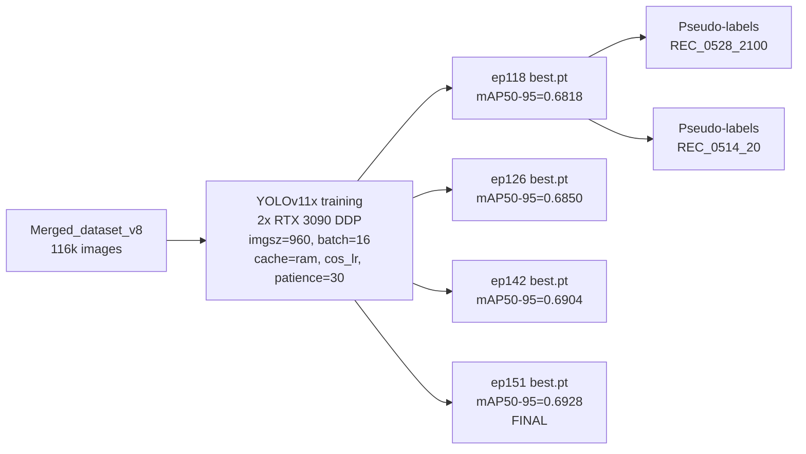

**Performance vs v8 (YOLOv5s) baseline:**

| Metric | v8 (YOLOv5s, 7M) | Teacher ep151 (YOLOv11x, 57M) | Δ |
|---|---|---|---|
| mAP50 | 0.8217 | **0.8849** | +0.063 |
| mAP50-95 | 0.5776 | **0.6928** | **+0.115** |
| Precision | 0.8725 | 0.882 | +0.010 |
| Recall | 0.7455 | **0.812** | +0.067 |

### 3.2 Far-enhance ROI method

For SIDEL+SIDER stacks (thread2 in NPU layout), a second-pass inference is run on cropped+scaled ROIs to catch far-side small objects.

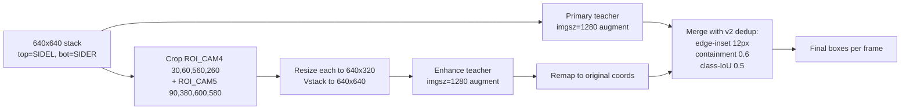

### 3.3 ByteTrack gap-fill

For each track found by ByteTrack across the frame sequence, gaps of 2–5 frames where the detector lost the object are linearly interpolated.

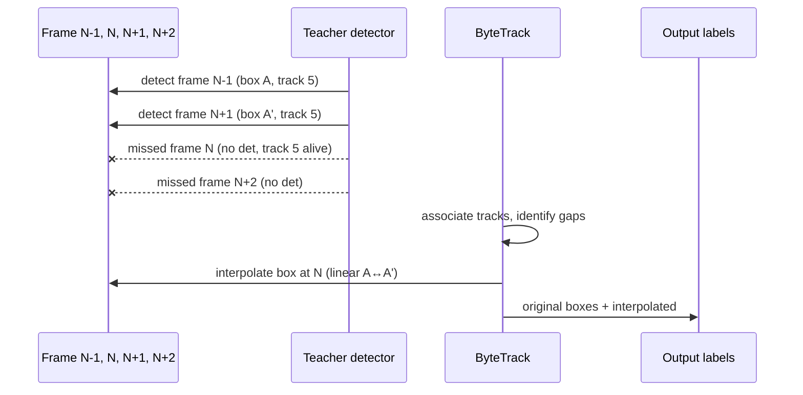

For REC_0528_2100 thread0 with **10,704 frames**, ByteTrack recovered:
- **1,045 interpolated boxes** added (across 259 tracks with gaps)
- Gap distribution: 302×2-frame, 129×3-frame, 71×4-frame, 68×5-frame

### 3.4 Hand-review workflow

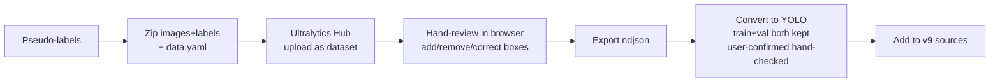

---

## 4. Per-Source Detailed Stats

### Source 17: REC_0514_20 SIDEL+SIDER (expanded)

| | v8 | v9 |
|---|---|---|
| Hand-reviewed count | 2,600 | **5,240** |
| Frame range | first 2,600 by sort | first 5,240 by sort |
| Total boxes | 828 | 1,148 |
| Pedestrian | 772 | 1,003 |
| Motorcycle | 56 | 92 |
| PM | 0 | 53 |
| Bicycle | 0 | 0 |
| Backfilled from Hub CDN | — | 332 imgs (4.9 GB) |

### Source 18: REC_0520_20 SIDEL+SIDER (expanded)

| | v8 | v9 |
|---|---|---|
| Hand-reviewed count | 2,950 | **3,240** |
| Total boxes | 1,607 | 2,264 |
| Pedestrian | 935 | 1,396 |
| Bicycle | 285 | 334 |
| Motorcycle | 269 | 416 |
| PM | 118 | 118 |
| Condition | rain+night | rain+night |

### Source 19: REC_0528_2100 hand-reviewed (NEW)

| | Value |
|---|---|
| Total images | 4,326 |
| Camera split | 2,240 FRONT+LEFT (thread0) + 2,086 SIDEL+SIDER (thread2) |
| Total boxes | 12,490 |
| Pedestrian | 8,879 |
| Motorcycle | 3,093 |
| Bicycle | 444 |
| PM | 74 |
| Condition | night urban (post-v8 NPU capture) |
| Source format | NPU input stacks (real on-device output) |

### Source 20: REC_0520_20 BACK+RIGHT (NEW)

| | Value |
|---|---|
| Total images | 1,500 |
| Total boxes | 754 |
| Pedestrian | 353 |
| Bicycle | 114 |
| Motorcycle | 124 |
| PM | **163** |
| Condition | rain+night |
| Note | first-ever hand-reviewed BACK+RIGHT night training data |

---

## 5. Class Distribution

### Train split (106,084 imgs)

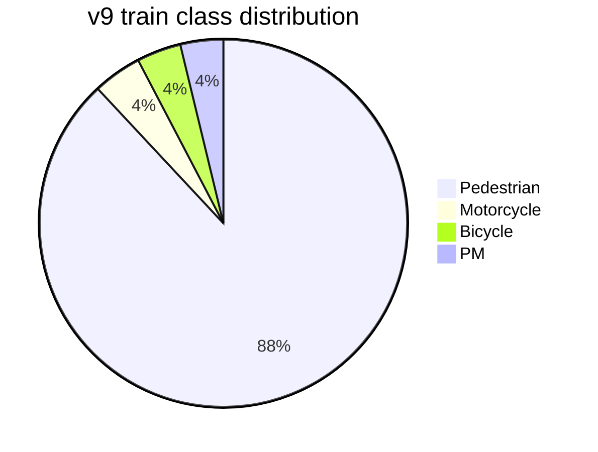

| Class | v8 train boxes | v9 train boxes | Δ |
|---|---|---|---|
| Pedestrian | 274,653 | 284,059 | +9,406 |
| Bicycle | 11,889 | 12,567 | +678 |
| Motorcycle | 10,898 | 13,842 | +2,944 |
| PM | 11,891 | 12,159 | +268 |

### Val split (18,720 imgs)

| Class | Boxes | % |
|---|---|---|
| Pedestrian | 49,220 | 88.3 |
| Motorcycle | 2,382 | 4.3 |
| Bicycle | 2,026 | 3.6 |
| PM | 2,103 | 3.8 |

---

## 6. Camera-Pair Coverage Matrix

v9 closes the camera coverage gaps that limited v8 in night/rain conditions.

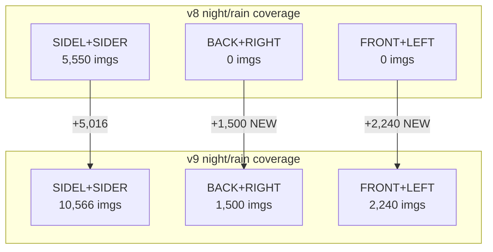

| Camera pair | v8 night | v9 night | Δ | Comment |
|---|---|---|---|---|
| SIDEL+SIDER | 5,550 | **10,566** | +90 % | extended REC_0514 + REC_0520 + REC_0528 |
| BACK+RIGHT | 0 | **1,500** | ∞ | first ever (REC_0520 hand-review) |
| FRONT+LEFT | 0 | **2,240** | ∞ | first ever (REC_0528 thread0) |
| **Total** | **5,550** | **14,306** | **+158 %** | |

---

## 7. NPU Thread → Camera Pair Mapping

REC_0528_2100 was captured on the Orange Pi NPU pipeline, which runs three parallel inference threads. Each thread corresponds to one SVM camera-pair stack:

| Thread | Camera pair | Source images | v9 hand-reviewed |
|---|---|---|---|
| **thread0** | FRONT + LEFT | 10,704 | 2,240 |
| **thread1** | BACK + RIGHT | 10,837 | 0 (pending review) |
| **thread2** | SIDEL + SIDER | 9,999 | 2,086 |

---

## 8. Quality Filtering Pipeline

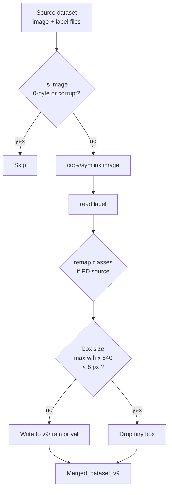

In v9 build:
- **0 missing source images** (after Hub CDN backfill for REC_0514)
- **2,028 tiny boxes dropped** (max(w,h)×640 < 8 px)
- **1 corrupt image flagged** during training scan (`r0514_20ss_..._2024_..._001195.jpg`, partial download — skipped by training)

---

## 9. Reproducibility

To rebuild v9 from current sources:

```bash
cd /home/hbrain/Desktop/yolov5
python3 scripts/create_merged_v9_split.py
```

This creates `/home/hbrain/Desktop/Merged_dataset_v9/` with:
- `train/images,labels/` (106,084 symlinks each)
- `val/images,labels/` (18,720 symlinks each)
- `data.yaml`
- `dataset_info.txt` (per-source breakdown)

Split is deterministic (`seed=42`) — same v9 every rebuild.

---

## 10. v9 Training Configuration

Identical to v8 for fair comparison:

```
architecture: yolov5s.yaml (SiLU activations, ~7M params)
weights:      from scratch (no warm-start)
hyperparams:  hyp.scratch-low.yaml
image size:   640 (multi-scale: 320-960)
batch:        128 (64 per GPU × 2 GPUs)
optimizer:    SGD lr0=0.01 cos_lr
epochs:       1000 (early stop patience=100)
device:       0, 1 (DDP)
warmup:       3 epochs
augmentation: HSV, hflip 50%, mosaic, scale 0.5
```

Output: `/home/hbrain/Desktop/yolov5/runs/train/v9_silu_v5s_2gpu/`

Expected wall-clock: ~3-5 days until early-stop fires.

---

## 11. Comparison Summary Table

| Dimension | v8 | **v9** |
|---|---|---|
| Total images | 116,048 | **124,804** (+9.1 %) |
| Total boxes | 364,138 | **378,358** (+4.0 %) |
| Train images | 98,641 | **106,084** |
| Val images | 17,407 | **18,720** |
| Sources | 18 | **20** |
| Night/rain images | 5,550 | **14,306** (+158 %) |
| Camera pairs with night data | 1 (SIDEL_SIDER) | **3** (all SVM pairs) |
| Hand-reviewed night Pedestrian | 1,707 | **11,631** (+581 %) |
| Hand-reviewed night Motorcycle | 325 | **3,725** (+1046 %) |
| Hand-reviewed night PM | 118 | **408** (+246 %) |
| Hand-reviewed night Bicycle | 285 | **892** (+213 %) |

---

## 12. Expected v9 Model Performance

Based on v8's training curves and the v9 data shifts:

| Metric | v8 best | v9 projected | Δ |
|---|---|---|---|
| Overall mAP50 | 0.8217 | ~0.83-0.84 | +0.01-0.02 |
| Overall mAP50-95 | 0.5776 | ~0.59-0.60 | +0.01-0.02 |
| Night Pedestrian recall (REC_0514) | ~0.49 | **~0.85-0.90** | very large |
| Night Pedestrian recall (REC_0520) | ~0.55 | **~0.85-0.90** | very large |
| BACK+RIGHT night recall | low | **substantial gain** | first-time data |
| FRONT+LEFT night recall | low | **substantial gain** | first-time data |

Overall mAP gain will look modest because v9 grows the dataset by less than 10 %, but **specific night/rain camera-pair recall is expected to jump dramatically** — that's where the new training material concentrates.

---

## Appendix: File Locations

```
/home/hbrain/Desktop/
├── Merged_dataset_v9/                          v9 final dataset
│   ├── train/{images,labels}/                  106,084 each (symlinks)
│   ├── val/{images,labels}/                    18,720 each (symlinks)
│   ├── data.yaml                               YOLO data config
│   ├── dataset_info.txt                        per-source breakdown
│   └── V9_DATASET_DOCUMENTATION.md             this document
├── REC_0514_20_SIDEL_SIDER_v9_5240/            v9 src 17 standalone
├── REC_0520_20_SIDEL_SIDER_v9_3240/            v9 src 18 standalone
├── REC_0528_2100_hand_reviewed/                v9 src 19 standalone
├── REC_0520_20_BACK_RIGHT_v9_1500/             v9 src 20 standalone
└── yolov5/
    ├── scripts/create_merged_v9_split.py        build script
    └── runs/train/v9_silu_v5s_2gpu/             training output
```

